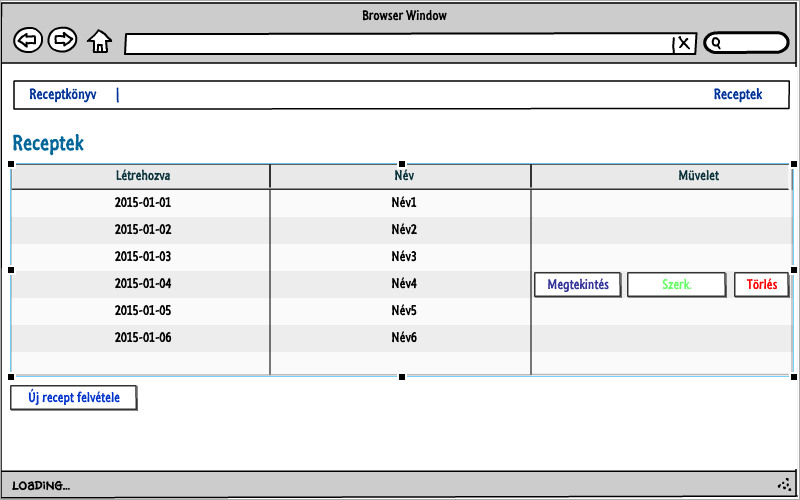
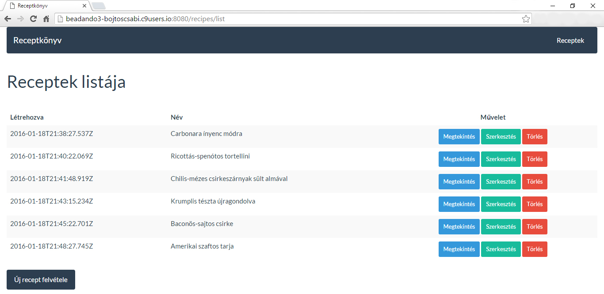
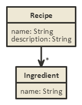

## ELTE Alkalmazások fejlesztése 3. beadandó
Bojtos Csaba (FWCSZH)

## Receptek és hozzávalók

### Követelményanalízis
A beadandó célja egy webes vastagkliens, azaz egyoldalas alkalmazás készítése Ember.js segítségével, amelyre a következő feltételek teljesülnek:

* legalább két modellt, egy-sok kapcsolatban
* legalább 1 űrlapot
* legalább 1 listázó oldalt
* legyen lehetőség új felvételére
* legyen lehetőség meglévő szerkesztésére
* legyen lehetőség meglévő törlésére
* REST API végpont kialakítása
* szerveroldali perzisztálás fájlba történik

#### Használatieset-modell

Az alkalmazás receptek és hozzávalóik gyűjtőhelyéül szolgál. Lehetőség van új receptek felvételére a név, az elkészítési folyamat ill. a hozzávalók megadásával. Az alkalmazás funkciói közé tartozik továbbá a receptek törlése és módosítása is.

### Tervezés
#### Végpontok
Az oldal az alábbi végpont-szerkezet alapján épül fel:

+ **/recipes**  
  + **/list** Az összes recept listája
  + **/new** Új recept hozzáadása
  + **/view/:recipe_id** Az adott azonosítójú recept megjelenítése
  + **/edit/:recipe_id** Recept szerkesztése

#### Oldalvázlat



#### Az alkalmazás kinézete a végleges megvalósításban



#### Osztálymodell



A `recipe` és `ingredient` modellek egy-sok kapcsolatban állnak egymással. A receptek ingredients attribútumán keresztül lekérdezhetők a hozzájuk tartozó hozzávalók gyűjteménye. A hozzávalók recipe attribútumán keresztül pedig a hozzá tartozó recept kérdezhető le.

### Implementáció
Az alkalmazás a `node.js` keretrendszer felhasználásával a [Cloud9](https://c9.io) online fejlesztő környezetben készült. A szerver oldalon Express+Fortune, míg a kliens oldalon Ember+jQuery dolgozik.


**Könyvtárstruktúrában lévő mappák funkciói:**
+ **app/**
  + **components/** Komponensek helye
  + **controllers/** Kontrollerek helye
  + **helpers/** Handlebars segédfunkciók
  + **models/** Modell definíciók
  + **pods/** POD-ok helye
  + **routes/** Routerek helye
  + **styles/** Stíluslapok
  + **app.js** Alkalmazás belépési pontja
  + **index.html** Alkalmazás-szintű template
  + **router.js** Alkalmazás-szintű router
+ **documentation/** Ezen dokumentációhoz tartozó képek
+ **public/** Megjelenítéshez szükséges statikus fájlok helye
+ **tests/** Tesztek helye
+ **vendor/**
+ **package.json** Az alkalmazás alapadatait ill. függőségeit tartalmazza
+ **README.md** Ezen dokumentáció

### Felhasználói dokumentáció
Szerver oldalon a `node` csomag megléte alapkövetelmény. A kliens oldal bármilyen, böngészővel rendelkező eszközzel használható.

#### Telepítés
1.Github tárolók klónozása: 
```
$ git clone https://github.com/bojtoscsabi/alkfejl3_restapi.git
$ git clone https://github.com/bojtoscsabi/alkfejl3.git
```
2.A szerver (REST API) indítása
```
$ npm start
```
3.Kliens indítása
```
$ npm start
```
